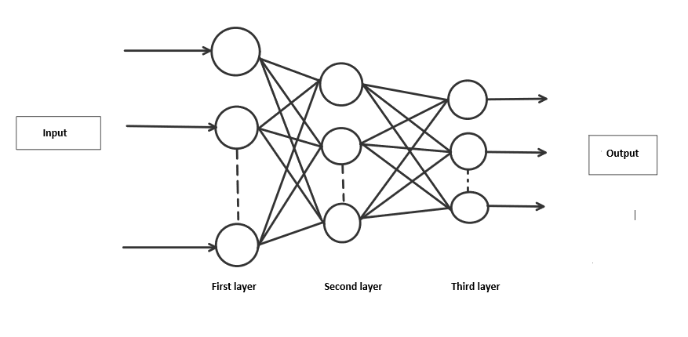
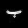
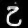
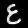
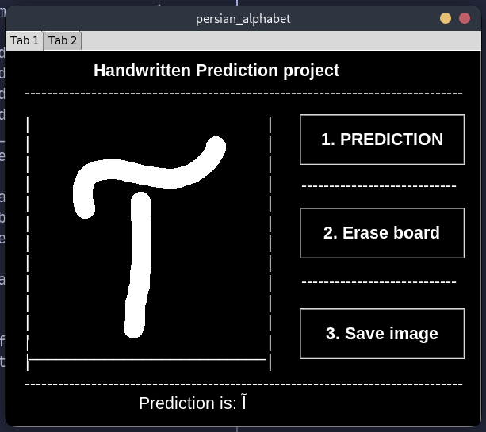
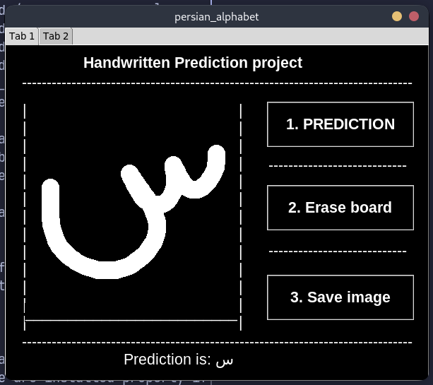
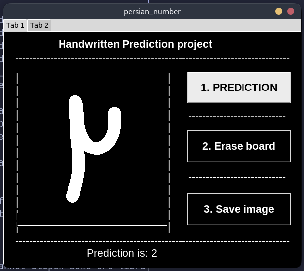

## Handwritten Digit and Alphabet Recognition using RNN

A neural network is a model inspired by how the brain works. It consists of multiple layers having many activations, this activation resembles neurons of our brain. A neural network tries to learn a set of parameters in a set of data which could help to recognize the underlying relationships. Neural networks can adapt to changing input; so the network generates the best possible result without needing to redesign the output criteria.

my project is a Recurrent Neural Network (RNN) model for recognizing handwritten digits and alphabets in **Farsi (Persian)**. Includes a custom dataset and preprocessing pipeline.

## Table of Contents
- [Features](#features)
- [Dataset](#dataset)
- [Installation](#installation)
- [Usage](#usage)
- [Model Architecture](#model-architecture)

## Features
- **Custom CSV Dataset**: Includes Farsi handwritten characters.
- Preprocessing scripts for image-to-csv conversion and normalization.
- Diffrent RNN models for alphabet and digits
- A simple GUI using tkinter for ease of use

## Dataset
I use a custome database that i use it in training the model, dataset should be in this format a csv file that every row have 785 coloum the first 784 coloum is image pixels valuse (28 pixel in 28 pixel) and last one is the value of that image for example character **آ** value is 0 and so on the rest of farsi alphabet

My custome dataset is in `files/persian alphabet/Train image/train_image_data_csv.csv` but tho to size limitation i cant upload it here but you can use your own custome dataset and place it in directory i mention:
- Columns: `pixel_values`, `label` (flattened 28x28 grayscale arrays and label value).
- **Labels**: 
  - **Digits**: 0-9 for numbers if you want to make digit prediction model.
  - **Alphabets**: 32 Farsi letters

some images in dataset:
| char(ب) | char(خ) | char(ع) |
|------|------|------|
||||

## Installation
1. Clone the repository:
   ```bash
   git clone https://github.com/mr-mahmood/handwrite-prediction-using-RNN.git
   cd handwrite-prediction-using-RNN
   ```
2. Install dependencies:
   ```bash
   pip install -r requirements.txt
   ```

## Usage
1. run the following command:
    ```bash
    python codes/main.py
    ```
2. select which model you wnat to use from persian alphabet and digit
3. after new window open draw a character and hit PREDICTION button

you should see something like this examples:
| char( آ ) | char( س  ) | digit( 2 ) |
|------|------|------|
||||

4. the result will apper under draw box showing what character model thing the draw is
5. you can use Erase board button to clear draw box
6. you can as well use tab2 to see what percent every character have for the draw that you give model

## Model Architecture
The model have 784 nodels input layer, two hidden layers first one have 300 nodes and second have 200 nodes and each of them have 0.2% dropout to prevent overfitting and a 32 nodes output in softmax which present possebilites of input base on input
```python
model = keras.Sequential([
    keras.Input(shape=(784,)),

    Dense(units=300, activation='relu'),
    Dropout(0.2),  # Add dropout layer with a rate of 0.2 (20%)

    Dense(units=200, activation='relu'),
    Dropout(0.2),  # Add dropout layer with a rate of 0.2 (20%)

    Dense(units=10, activation='softmax'),
])
```
